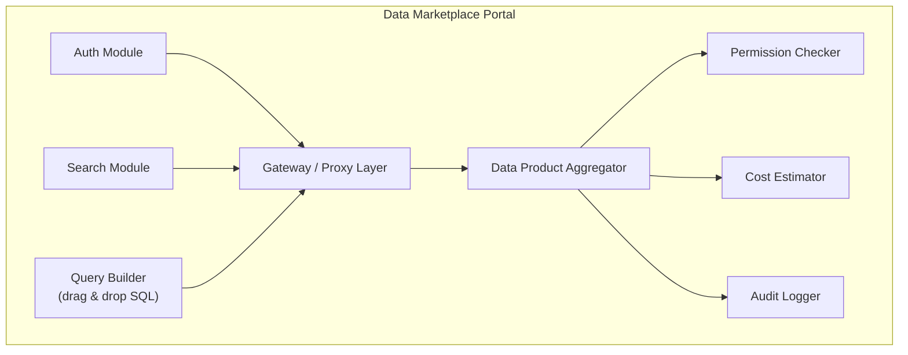
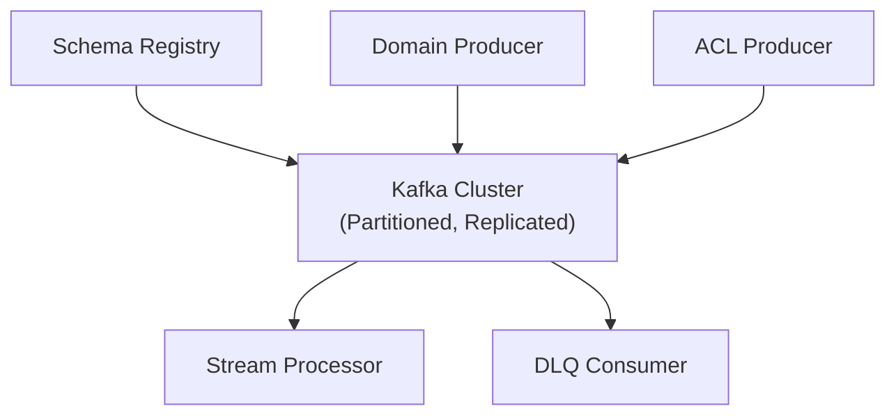
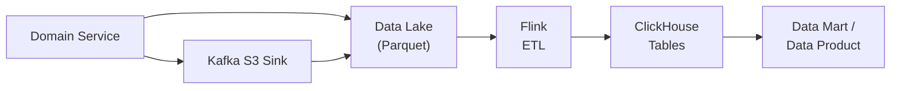

# C4-модель целевой архитектуры «Будущее 2.0»

## Уровень 2 — Container Diagram

### Контекст

Система предназначена для медицинских, финансовых, ИИ-сервисов, а также для интегрируемых фармацевтических предприятий и производителей медицинского оборудования. Основные пользователи: врачи, пациенты, финансовые операторы, бизнес-аналитики.

### Инфраструктурный слой

| Контейнер         | Технология            | Назначение                                        |
|-------------------|-----------------------|---------------------------------------------------|
| API Gateway       | Kong / NGINX          | Маршрутизация, аутентификация, rate limiting      |
| Event Bus         | Apache Kafka          | Событийная шина, DLQ, Schema Registry             |
| Identity Provider | Keycloak              | SSO, RBAC, управление доступом                    |
| Monitoring        | Prometheus + Grafana  | Сбор метрик, логов, алертинг                      |

### Доменные сервисы

Каждый домен изолирован, взаимодействует через Event Bus, экспортирует данные в Data Lake.

| Домен                 | Стек         | Функции                                              |
|-----------------------|--------------|------------------------------------------------------|
| Medical Domain        | Go / Java    | Медкарты, диагностика, запись к врачу                |
| Fintech Domain        | Java / Go    | Платежи, кредиты, банковские счета                   |
| AI Domain             | Python       | ИИ-диагностика, анализ изображений, ML-модели        |
| Pharma Domain         | Go / Java    | Управление фармацевтическими поставками              |
| Electronics Domain    | Go           | Управление производством мед. оборудования           |

### Платформа данных

| Компонент          | Технология                    | Назначение                                |
|--------------------|-------------------------------|-------------------------------------------|
| Data Lake          | Yandex Object Storage / S3    | Хранение сырых данных (Parquet)           |
| OLAP Engine        | ClickHouse                    | Аналитические запросы, витрины            |
| Stream Processor   | Apache Flink / Kafka Streams  | Near-real-time обработка                  |
| Data Catalog       | OpenMetadata / DataHub         | Каталог схем, Data Product Registry       |
| Data Marketplace   | React + Java Backend          | Портал самообслуживания для отчётов       |

### Интеграция с легаси

| Компонент      | Назначение                                    |
|----------------|-----------------------------------------------|
| ACL DWH        | CDC (Debezium) из SQL Server → события Kafka  |
| ACL ESB        | Адаптация сообщений Camel → события Kafka     |

---

## Уровень 3 — Component Diagram (ключевые контейнеры)

### 3.1 Data Marketplace Portal

### 3.2 Event Bus Integration

### 3.3 Data Lake → OLAP Pipeline

---

## Ключевые архитектурные решения

1. **Событийно-ориентированная архитектура** — все домены взаимодействуют через Kafka, никаких прямых синхронных вызовов между доменами
2. **Data Mesh / Data Products** — каждый домен владеет своими данными и публикует их как Data Product через каталог
3. **Anti-Corruption Layers** — изолируют легаси (DWH, ESB) от новых сервисов
4. **Near-real-time processing** — Flink/Kafka Streams для обработки данных без batch-окон
5. **Единый Data Catalog** — OpenMetadata для регистрации всех Data Products и схем
6. **Cloud-native** — инфраструктура в Yandex Cloud (IaaC через Terraform)
