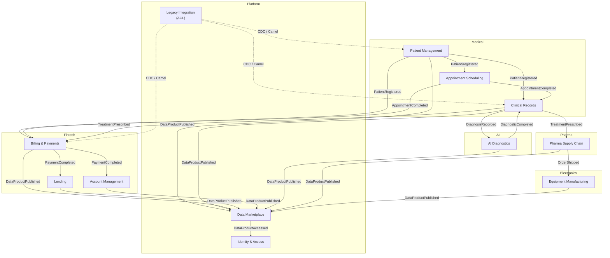

# Bounded Contexts — «Будущее 2.0»

## Контекстная карта

## Описание bounded contexts

| # | Bounded Context | Домен | Ответственность | Ключевой агрегат |
|---|---|---|---|---|
| 1 | Patient Management | Medical | Регистрация и ведение профилей пациентов | Patient |
| 2 | Clinical Records | Medical | Медицинские карты, диагнозы, назначения | MedicalRecord |
| 3 | Appointment Scheduling | Medical | Запись к врачу, расписание | Appointment |
| 4 | Billing & Payments | Fintech | Оплата услуг, обработка транзакций | Payment |
| 5 | Lending | Fintech | Кредитные договоры, займы | LoanAgreement |
| 6 | Account Management | Fintech | Банковские счета, остатки | BankAccount |
| 7 | AI Diagnostics | AI | ИИ-диагностика изображений и данных | AIDiagnosticRequest |
| 8 | Pharma Supply Chain | Pharma | Управление фарм. поставками | PharmaOrder |
| 9 | Equipment Manufacturing | Electronics | Производство мед. оборудования | ProductionBatch |
| 10 | Data Marketplace | Platform | Каталог Data Product, самообслуживание | DataProduct |
| 11 | Identity & Access | Platform | SSO, RBAC, аудит доступа | User |
| 12 | Legacy Integration | Platform | Anti-Corruption Layer для DWH и ESB | — (интеграция) |

## Правила взаимодействия

1. **Нет прямых синхронных вызовов между bounded contexts** — только асинхронные события через Kafka.
2. **Каждый контекст владеет своими данными** — публикует Data Product через Data Marketplace, а не через общую БД.
3. **Clinical Records не экспортирует данные в Data Marketplace** — согласно политике компании, медкарты и истории болезней не используются для аналитики.
4. **Legacy Integration** — единственный контекст, имеющий прямой доступ к DWH и ESB; все остальные контексты взаимодействуют с легаси только через него.
