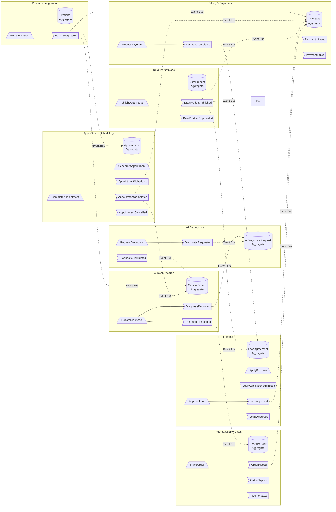

# Event Storming — событийная архитектура «Будущее 2.0»

## Условные обозначения

- 🟦 **Command** — команда, инициирующая действие
- 🟩 **Event** — доменное событие, факт, произошедший в системе
- 🟧 **Aggregate** — агрегат, в рамках которого происходит событие
- 🟥 **External System** — внешняя система (легаси)

## Поток событий

## Таблица событий

| Событие | Контекст-источник | Команда-триггер | Подписчики |
|---|---|---|---|
| PatientRegistered | Patient Management | RegisterPatient | Appointment Scheduling, Billing & Payments, Clinical Records |
| AppointmentScheduled | Appointment Scheduling | ScheduleAppointment | Patient Management (уведомление) |
| AppointmentCompleted | Appointment Scheduling | CompleteAppointment | Clinical Records, Billing & Payments |
| AppointmentCancelled | Appointment Scheduling | CancelAppointment | Billing & Payments |
| DiagnosisRecorded | Clinical Records | RecordDiagnosis | AI Diagnostics |
| TreatmentPrescribed | Clinical Records | PrescribeTreatment | Pharma Supply, Billing & Payments |
| PaymentInitiated | Billing & Payments | InitiatePayment | — (внутреннее) |
| PaymentCompleted | Billing & Payments | ProcessPayment | Lending |
| PaymentFailed | Billing & Payments | ProcessPayment | Lending, Appointment Scheduling |
| DiagnosticRequested | Appointment Scheduling | RequestDiagnostic | AI Diagnostics |
| DiagnosticCompleted | AI Diagnostics | CompleteDiagnostic | Clinical Records |
| LoanApplicationSubmitted | Lending | ApplyForLoan | — (внутреннее) |
| LoanApproved | Lending | ApproveLoan | Account Management, Billing & Payments |
| LoanDisbursed | Lending | DisburseLoan | Account Management |
| OrderPlaced | Pharma Supply Chain | PlaceOrder | Billing & Payments |
| OrderShipped | Pharma Supply Chain | ShipOrder | Equipment Manufacturing |
| InventoryLow | Pharma Supply Chain | — (автоматическое) | Equipment Manufacturing, Clinical Records |
| DataProductPublished | Data Marketplace | PublishDataProduct | Все домены (уведомление) |
| DataProductDeprecated | Data Marketplace | DeprecateDataProduct | Все домены (уведомление) |
| UserLoggedIn | Identity & Access | Authenticate | Data Marketplace (аудит) |
| RoleAssigned | Identity & Access | AssignRole | Все защищённые контексты |
