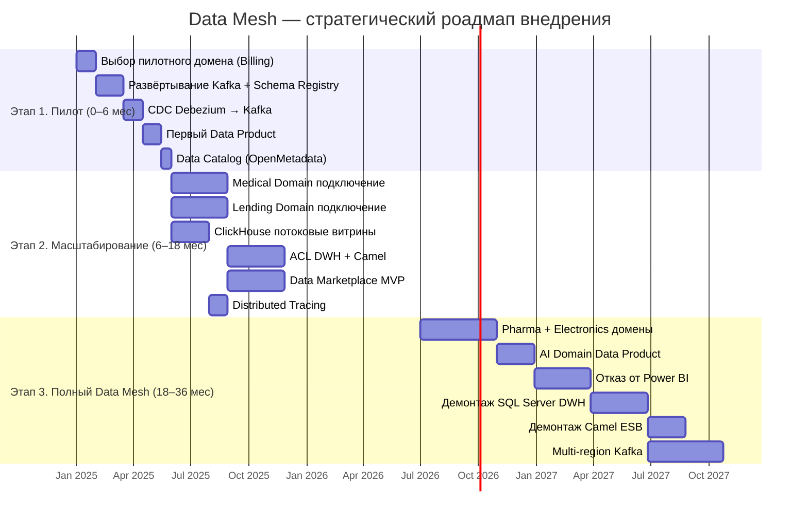

# Стратегический роадмап внедрения Data Mesh

## Принципы

- Роадмап синхронизирован с трёхэтапной трансформацией из контекста компании
- Каждый этап привязан к бизнес-целям
- Ключевые роли: Data Product Owner (DPO), Data Engineer (DE), BI-аналитик, Platform Engineer (PE)

---

## Этап 1. Пилот (0–6 месяцев)

**Бизнес-цель**: Запуск пилотного Data Product, валидация подхода, обучение команды.

### Ключевые активности

| Активность | Ответственный | Результат |
|---|---|---|
| Выбор пилотного домена (Billing & Payments) | Architect + DPO | Согласованный домен |
| Формирование платформенной команды (2 PE) | CTO / VP Eng | Platform Team готова |
| Развёртывание Kafka + Schema Registry в Yandex Cloud | PE | Событийная шина запущена |
| Определение первого Data Product (данные по платежам) | DPO + BI-аналитик | Product Backlog |
| Написание первого stream-процессора (Flink) | DE | ETL-пайплайн |
| Подключение CDC (Debezium) к SQL Server → Kafka | DE | События из легаси поступают в Kafka |
| Обучение команд (Kafka, Data Mesh) | Architect | 2–3 workshops |
| Публикация Data Product в Data Catalog (OpenMetadata) | DPO | Каталог пополнен |

### Состав команды

| Роль | FTE | Кто |
|---|---|---|
| Data Product Owner | 1 | От бизнеса (Fintech) |
| Data Engineer | 2 | Платформа + домен |
| BI-аналитик | 1 | Потребление Data Product |
| Platform Engineer | 2 | Инфраструктура |
| Architect | 0.5 | Консультация |

### KPI

- ✅ Первый Data Product опубликован и доступен аналитикам
- ✅ Задержка данных: с batch (часы) → near-real-time (минуты)
- ✅ Time-to-market для нового отчёта: с 2 недель → 2 дня

---

## Этап 2. Масштабирование (6–18 месяцев)

**Бизнес-цель**: Расширение на критические домены (Medical, AI, Lending), запуск потоковых витрин.

### Ключевые активности

| Активность | Ответственный | Результат |
|---|---|---|
| Подключение Medical Domain к событийной платформе | DE + DPO (Medical) | Data Product пациента |
| Подключение Lending Domain | DE + DPO (Fintech) | Data Product кредитов |
| Запуск потоковых витрин в ClickHouse | DE | Real-time дашборды |
| Построение ACL для DWH-интеграций | PE + DE | Легаси изолированы |
| Построение ACL для Camel-интеграций | PE + DE | ESB-трафик через Kafka |
| Разработка Data Marketplace Portal (MVP) | Dev Team | Самообслуживание для BI |
| Внедрение Distributed Tracing (Jaeger) | PE | Сквозная трассировка |
| Определение SLA для каждого Data Product | DPO + BI | Соглашения опубликованы |
| Запуск регулярного аудита событий (compliance) | DPO + Legal | Соответствие ЦБ РФ, Минздраву |

### Состав команды

| Роль | FTE | За счёт |
|---|---|---|
| Data Product Owner | 3 | Billing, Medical, Lending |
| Data Engineer | 6 | 2 × платформа, 4 × домены |
| BI-аналитик | 3 | Потребление, обучение self-service |
| Platform Engineer | 3 | Kafka, ClickHouse, S3 |
| Domain Developer | 6 | Адаптация микросервисов к событиям |
| Architect | 1 | Координация cross-domain |

### KPI

- ✅ 3+ домена публикуют Data Products
- ✅ 80% критических отчётов переведены на потоковые витрины
- ✅ Время формирования сложного отчёта: с часов → < 10 секунд
- ✅ Задержка данных: < 1 минута (от события до дашборда)

---

## Этап 3. Полный Data Mesh (18–36 месяцев)

**Бизнес-цель**: Все домены публикуют Data Products, легаси-системы выведены, Data Marketplace — единая точка входа для аналитики.

### Ключевые активности

| Активность | Ответственный | Результат |
|---|---|---|
| Подключение Pharma Supply Chain | DPO (Pharma) + DE | Data Product заказов |
| Подключение Equipment Manufacturing | DPO (Electronics) + DE | Data Product производства |
| Подключение AI Diagnostics (результаты, не сырые данные) | DPO (AI) + DE | Data Product ИИ-аналитики |
| Отказ от Power BI → Data Marketplace как стандарт | BI Lead | Единый портал отчётности |
| Демонтаж PowerBuilder-интерфейсов | Dev Team | Полная миграция на Web |
| Демонтаж SQL Server DWH (после миграции всех Data Products) | PE | DWH выключен |
| Отказ от Camel-шины | PE | Только Kafka |
| Автоматизация Data Product lifecycle | PE + DPO | CI/CD для Data Products |
| Мониторинг SLA и SLO для всех Data Products | PE | Дашборд качества данных |
| Выход в новые регионы (геораспределённый Kafka) | PE | Multi-region |

### Состав команды

| Роль | FTE | За счёт |
|---|---|---|
| Data Product Owner | 5 | Каждый домен + Data Marketplace |
| Data Engineer | 9 | Платформа + все домены |
| BI-аналитик | 3 | Self-service power users |
| Platform Engineer | 6 | SRE + Data Platform |
| Domain Developer | 20 | Развитие микросервисов |

### KPI

- ✅ Все 8 доменов публикуют Data Products
- ✅ 100% отчётов через Data Marketplace (0 legacy BI)
- ✅ Легаси-системы выведены
- ✅ Возможность подключения нового домена за 1 неделю
- ✅ Time-to-market для нового Data Product: < 2 недель

---

## Визуализация роадмапа

## Ролевая модель

| Роль | Ключевые обязанности | Отчётность |
|---|---|---|
| **Data Product Owner** | Определяет content Data Product, SLA, политику доступа; приоритизирует бэклог | Head of Domain / CDO |
| **Data Engineer** | Строит пайплайны, настраивает CDC/streaming, управляет схемами, обеспечивает качество данных | Platform Lead / Domain Lead |
| **BI-аналитик** | Потребляет Data Products, строит отчёты через self-service портал, пишет feedback DPO | Head of Analytics |
| **Platform Engineer** | Управляет инфраструктурой (Kafka, ClickHouse, S3, Kubernetes), мониторинг, SLA платформы | Platform Lead |
| **Domain Developer** | Адаптирует микросервисы для публикации событий, реализует bounded contexts | Domain Lead |
| **Data Architect** | Устанавливает стандарты, проводит ревью, эволюционирует Data Mesh практики | CDO / CTO |
