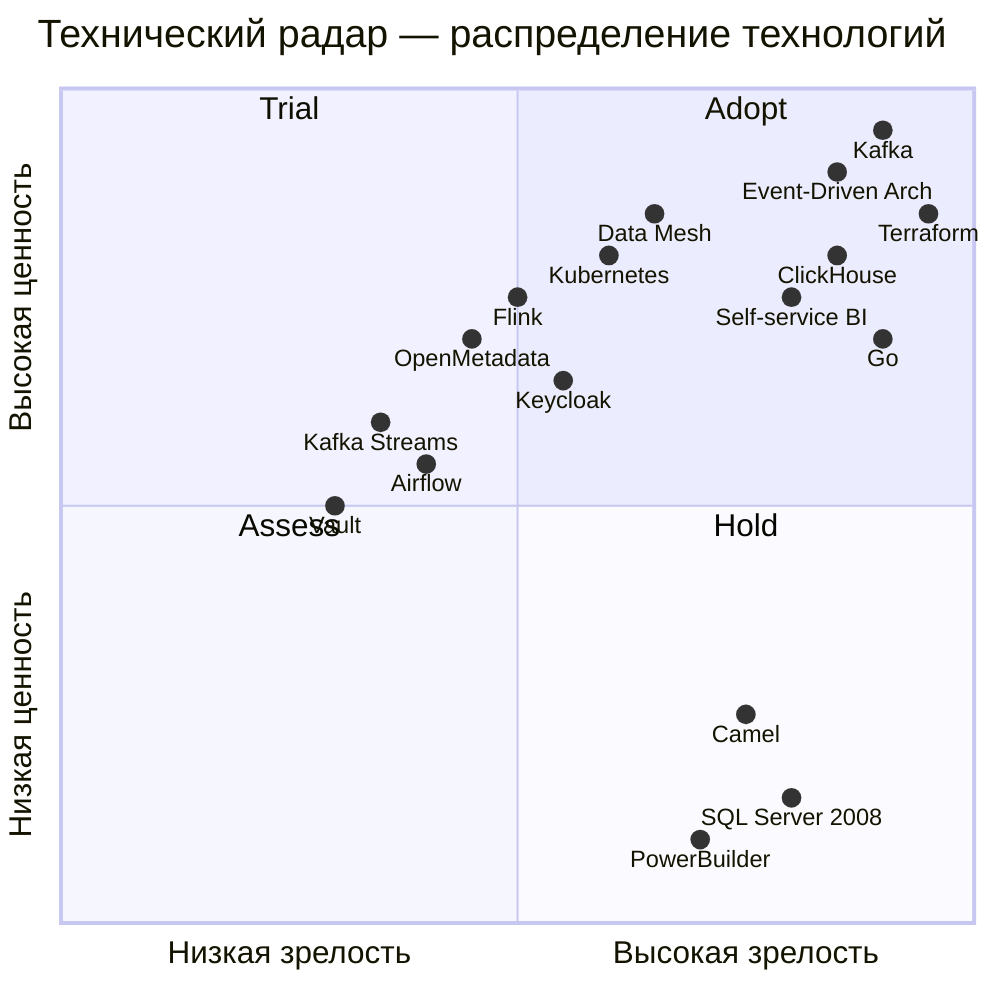

# Расширенный технический радар «Будущее 2.0»

## Легенда

| Статус | Значение |
|---|---|
| **Adopt** | Технология / паттерн рекомендована к использованию, есть успешный опыт |
| **Trial** | Пилотируется в ограниченном объёме, накопление компетенций |
| **Assess** | Оценивается пригодность для задач компании |
| **Hold** | Не рекомендуется к использованию, требуется миграция |

---

## Архитектурные паттерны

| Технология / паттерн | Статус | Обоснование |
|---|---|---|
| Event-Driven Architecture | **Adopt** | Основа целевой архитектуры. Все домены взаимодействуют через события |
| Data Mesh | **Trial** | Внедряется пилотно в 1-2 доменах (финансы, пациентский поток) |
| Self-service BI | **Adopt** | Data Marketplace как портал самообслуживания для бизнес-аналитики |
| CQRS | **Trial** | Разделение чтения и записи в доменах с высокой нагрузкой (Fintech) |
| Saga (Orchestration) | **Assess** | Для распределённых транзакций (кредитование + платёж) |
| Anti-Corruption Layer | **Adopt** | Изоляция легаси DWH и ESB от новых доменов |
| Data Product | **Adopt** | Каждый домен публикует данные как Data Product с владельцем и SLA |
| Domain-Driven Design | **Adopt** | Разделение на bounded contexts, единый ubiquitous language |
| Strangler Fig | **Adopt** | Поэтапное замещение легаси-модулей новыми сервисами |

---

## Инфраструктура и платформа

| Технология / компонент | Статус | Обоснование |
|---|---|---|
| Yandex Cloud | **Adopt** | Основной облачный провайдер (IaaC через Terraform) |
| Terraform | **Adopt** | Управление инфраструктурой через код |
| Kubernetes (Managed) | **Trial** | Оркестрация микросервисов в пилотных доменах |
| Docker | **Adopt** | Контейнеризация всех новых сервисов |
| GitLab CI | **Adopt** | CI/CD пайплайны для инфраструктуры и приложений |
| Prometheus + Grafana | **Adopt** | Мониторинг, метрики, алертинг |
| Jaeger / OpenTelemetry | **Trial** | Distributed tracing для отладки событийных потоков |

---

## Потоки данных и интеграция

| Технология / компонент | Статус | Обоснование |
|---|---|---|
| Apache Kafka | **Adopt** | Событийная шина, DLQ, retention, replay |
| Kafka Schema Registry | **Adopt** | Управление схемами событий (Avro, backward compatibility) |
| Kafka S3 Sink Connector | **Adopt** | Сброс событий в Data Lake |
| Apache Flink | **Trial** | Stream processing на pilot-доменах |
| Kafka Streams | **Assess** | Альтернатива Flink для лёгких процессоров |
| Debezium (CDC) | **Adopt** | Захват изменений из SQL Server → события Kafka |
| Apache Camel | **Hold** | Замена на Kafka; используется только как ACL-мост на этапе миграции |

---

## Хранение и аналитика данных

| Технология / компонент | Статус | Обоснование |
|---|---|---|
| Yandex Object Storage (S3) | **Adopt** | Data Lake для сырых данных (Parquet) |
| ClickHouse | **Adopt** | OLAP-движок для аналитических витрин |
| OpenMetadata / DataHub | **Trial** | Data Catalog + Data Product Registry |
| Power BI | **Trial** | Сохраняется для существующих отчётов; новые отчёты → через Data Marketplace |
| SQL Server 2008 | **Hold** | Легаси DWH; план миграции на ClickHouse + Data Lake |
| Airflow | **Assess** | Оркестрация batch-процессов в переходный период |

---

## Языки и фреймворки

| Технология / компонент | Статус | Обоснование |
|---|---|---|
| Go | **Adopt** | Основной язык для новых микросервисов (Medical, Electronics) |
| Java (Spring Boot) | **Adopt** | Fintech-домен, существующие компетенции |
| Python | **Adopt** | AI-домен, ML-модели, stream processing (Flink/PyFlink) |
| React | **Adopt** | Data Marketplace Portal |
| PowerBuilder | **Hold** | Легаси; план миграции на React/Web-интерфейсы |

---

## Безопасность и управление доступом

| Технология / компонент | Статус | Обоснование |
|---|---|---|
| Keycloak | **Trial** | SSO, RBAC, Identity Provider для пилотных доменов |
| HashiCorp Vault | **Assess** | Управление секретами для сервисов и CI/CD |
| OAuth 2.0 / OIDC | **Adopt** | Стандарт аутентификации для всех API |

---

## Визуализация радара

